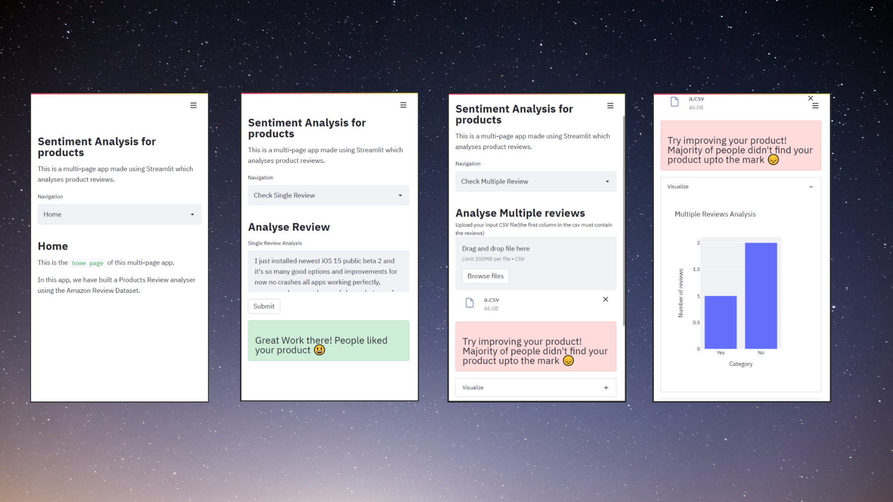

# Sentiment Analysis on Product Review

This is the repository for the Sentiment Analysis on [Product Reviews](https://www.kaggle.com/bittlingmayer/amazonreviews) for classifying positive and negative reviews.

` Built Using Machine Learning `


[](https://share.streamlit.io/kehsihba19/sentiment-on-review/Frontend/main.py)


[](https://www.python.org/)


## Project Breakdown
<li>Training Model</li>
<li>Backend support to get prediction for a review using API</li>
<li>Frontend support for users to interact with API</li>

---

### Training Machine Learning Model
<li>Fetching Data</li>
<li>Cleaning Data</li>
<li>Fitting the model for highest accuracy</li>
<li>Saving the model</li>
  
 <br>
 
`👇 Checkout the jupyter notebook of the trained model`
  
[](https://nbviewer.jupyter.org/github/kehsihba19/Sentiment-On-Review/blob/master/Model%20Training/Sentiment%20Analysis%20on%20Amazon%20Product%20Reviews.ipynb)

---

### Backend Server


`The Backend server is written using Python Framework FastAPI and hosted on Heroku`

<li>Post request with product review will return a response about the type of rating</li>

<br>

`👇 Read More about the documentation of API`


[](https://backend-fastapi.herokuapp.com/docs)


---


### Frontend


`The Frontend is written using Python Framework Streamlit and hosted on Streamlit hosting service`
<li> Single Review Analysis</li>
<li> Multiple Review Analyis(File upload with format as csv)</li>
  
  <br>
  
  
`👇 Checkout the website`


[](https://share.streamlit.io/kehsihba19/sentiment-on-review/Frontend/main.py)


---

## UI Design



---
## 🛠 Local Setup


``` 

1. Clone the repo
>> git clone repo_link

2. Change your current directory to the repo
>> cd directory_name

3. Activate virtual environment
>> $base> python -m venv venv
>> $base> .\venv\Scripts\activate

4. Run the backend server
>> (venv) $base> cd Backend
>> (venv) $base/Backend> pip install -r requirements.txt
>> (venv) $base/Backend> uvicorn main:app --reload

5. Run the frontend server(make sure to edit url for API calls to backend server url)
>> (venv) $base> cd Frontend
>> (venv) $base/Frontend> pip install -r requirements.txt
>> (venv) $base/Frontend> streamlit run main.py

```


## Contributing

Pull requests are welcome. 

For major changes, please open an issue first to discuss what you would like to change.


### Show some :heart: and :star: the repo to support the project

## License

[GPL-3.0 License](https://choosealicense.com/licenses/mit/)

### Star the Repo in case you liked it :)

### © [kehsihba19](https://bit.ly/kehsihba19)
